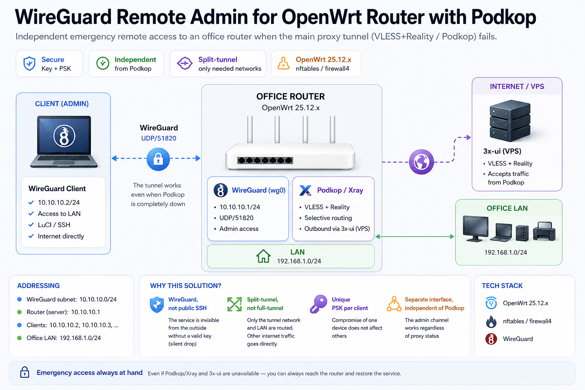

[Русская версия](https://github.com/Ragelson/openwrt-wireguard-remote-admin-ru)
# WireGuard Remote Admin for an OpenWrt Router Running Podkop

Emergency remote access to an office router (OpenWrt 25.12.x, nftables/firewall4) via WireGuard — independent of the primary selective-routing tunnel ([Podkop](https://github.com/itdoginfo/podkop) / VLESS Reality) running on the same device.

## Contents

- [Problem](#problem)
- [Design decisions](#design-decisions)
- [Diagram](#diagram)
- [1. Packages and keys](#1-packages-and-keys)
- [2. wg0 interface](#2-wg0-interface)
- [3. Firewall](#3-firewall)
- [4. Compatibility with Podkop](#4-compatibility-with-podkop)
- [5. Client side](#5-client-side)
- [6. Managing clients](#6-managing-clients)
- [7. Troubleshooting](#7-troubleshooting)
- [Stack](#stack)
- [Security](#security)

## Problem

The office router performs selective routing of part of its traffic through Podkop (VLESS+Reality → [3x-ui](https://github.com/MHSanaei/3x-ui) on a VPS). If the proxy chain on the router fails or needs reconfiguring, and there's no physical access to the device, an independent channel into LuCI/SSH is needed.

Solution: a WireGuard tunnel directly to the office's static public IP. Administrative access survives even if Podkop is completely down.

## Design decisions

**WireGuard, not public SSH.** An open SSH port on the WAN is a permanent attack surface (brute force, scanners). WireGuard doesn't respond to packets without a valid key (silent drop) — the service is effectively invisible from outside.

**Split-tunnel, not full-tunnel.** `AllowedIPs` is limited to the tunnel subnet and the office LAN. The rest of the client's internet traffic goes out directly — no extra load on the office link, and no risk of accidentally routing personal traffic through work infrastructure.

**A separate preshared key per client.** PSK is an additional symmetric layer on top of the asymmetric key pair. A shared PSK would mean that compromising one device weakens the security of every other client's connection.

**WireGuard as a standalone interface, not layered on top of Podkop.** The most common reason to reach the router is a failure in the proxy itself. The admin channel has to stay alive independently of its state.

## Diagram



```
Client (admin) ──WireGuard (UDP/51820)──► Static public IP ──► wg0 (10.10.10.1/24) ──► LAN (192.168.1.0/24)
```

Inside the router, WireGuard (wg0) and Podkop/Xray are two independent stacks (interfaces + nftables chains) that never overlap.

Addressing:

| Node | Address |
|---|---|
| Tunnel subnet | `10.10.10.0/24` |
| Router (server) | `10.10.10.1` |
| Clients | `10.10.10.2`, `10.10.10.3`, … |
| Office LAN | `192.168.1.0/24` |

## 1. Packages and keys

On the router (over SSH from the local network):

```bash
apk add wireguard-tools luci-proto-wireguard

mkdir -p /etc/wireguard && cd /etc/wireguard
umask 077

# Server (router) keys
wg genkey | tee server_private.key | wg pubkey > server_public.key

# First client's keys
wg genkey | tee client_private.key | wg pubkey > client_public.key

# Pre-shared key (unique to this pair)
wg genpsk > preshared.key
```

`umask 077` ensures the key files are readable only by root.

## 2. wg0 interface

UCI doesn't perform `$(...)` substitution inside config files — key values are inserted via shell variables in a heredoc:

```bash
SERVER_PRIV=$(cat /etc/wireguard/server_private.key)
CLIENT_PUB=$(cat /etc/wireguard/client_public.key)
PSK=$(cat /etc/wireguard/preshared.key)

cat >> /etc/config/network << EOF

config interface 'wg0'
    option proto 'wireguard'
    option private_key '$SERVER_PRIV'
    option listen_port '51820'
    list addresses '10.10.10.1/24'

config wireguard_wg0
    option description 'admin-remote'
    option public_key '$CLIENT_PUB'
    option preshared_key '$PSK'
    list allowed_ips '10.10.10.2/32'
    option route_allowed_ips '1'
EOF

/etc/init.d/network restart
```

Verification:

```bash
ip addr show wg0    # interface UP, address 10.10.10.1/24
wg show             # server public key, port 51820, client peer
```

> **Note:** the `cat >> ...` block appends to the end of the file. Running it twice will duplicate the sections — see [Troubleshooting](#7-troubleshooting).

## 3. Firewall

```bash
cat >> /etc/config/firewall << 'EOF'

config zone
    option name 'wireguard'
    option input 'ACCEPT'
    option output 'ACCEPT'
    option forward 'ACCEPT'
    list network 'wg0'

config forwarding
    option src 'wireguard'
    option dest 'lan'

config forwarding
    option src 'lan'
    option dest 'wireguard'

config rule
    option name 'Allow-WireGuard'
    option src 'wan'
    option proto 'udp'
    option dest_port '51820'
    option target 'ACCEPT'
EOF

/etc/init.d/firewall restart
```

The `Allow-WireGuard` rule is mandatory: without it, inbound UDP packets on 51820 from the WAN are dropped and the connection never comes up.

Verify the rule actually landed in nftables:

```bash
nft list ruleset | grep -B2 -A2 "51820"
```

Expected line:

```
udp dport 51820 counter packets 0 bytes 0 accept comment "!fw4: Allow-WireGuard"
```

A `packets 0` counter before the first client connects is normal.

## 4. Compatibility with Podkop

Podkop creates its own nftables table, `PodkopTable`, and matches traffic by:

- `iifname @interfaces` — outbound traffic from LAN clients;
- `ip daddr` against the `podkop_subnets` / `podkop_discord_subnets` sets and the FakeIP range `198.18.0.0/15`.

Inbound WireGuard traffic on port 51820 arrives from the WAN at the router itself and never matches these conditions — there's no conflict. Check before setting up:

```bash
ip rule show                              # only local/main/default — fine
ip route show table all | grep -i podkop  # empty: Podkop creates no separate routing tables
nft list ruleset | grep -i -A5 podkop     # no rules on udp dport 51820
```

## 5. Client side

### Config template

```ini
[Interface]
PrivateKey = <client_private.key>
Address = 10.10.10.2/24
DNS = 192.168.1.1

[Peer]
PublicKey = <server_public.key>
PresharedKey = <preshared.key>
Endpoint = <static_public_ip>:51820
AllowedIPs = 10.10.10.0/24, 192.168.1.0/24
PersistentKeepalive = 25
```

`PersistentKeepalive = 25` keeps the client's NAT binding alive — without it the tunnel "falls asleep" and the first packets after idle time get dropped.

### Official clients

| Platform | Link |
|---|---|
| iOS | [App Store](https://apps.apple.com/app/wireguard/id1441195209) |
| Android | [Google Play](https://play.google.com/store/apps/details?id=com.wireguard.android) / [direct APK](https://download.wireguard.com/android-client/) |
| Windows | [wireguard.com/install](https://www.wireguard.com/install/) |
| macOS | [App Store](https://apps.apple.com/app/wireguard/id1451685025) |
| Linux | [wireguard.com/install](https://www.wireguard.com/install/) (`wireguard-tools` + `wg-quick`) |

### Importing on mobile

1. Install the official WireGuard app.
2. `+` → "Create from QR code" (the QR is generated from the `.conf` contents with any generator, e.g. the Python `qrcode` package), or `+` → "Import from file or archive".
3. Turn the tunnel on and confirm a handshake appears (sent/received counters increasing).

The `.conf` file and QR code contain a private key — don't keep them lying around in the open longer than needed for import, and don't send them over unencrypted channels.

## 6. Managing clients

### Adding a client

Each client gets its own key pair and its own preshared key:

```bash
cd /etc/wireguard
umask 077

wg genkey | tee client2_private.key | wg pubkey > client2_public.key
wg genpsk > preshared2.key

CLIENT2_PUB=$(cat client2_public.key)
PSK2=$(cat preshared2.key)

uci add network wireguard_wg0
uci set network.@wireguard_wg0[-1].description='client2-remote'
uci set network.@wireguard_wg0[-1].public_key="$CLIENT2_PUB"
uci set network.@wireguard_wg0[-1].preshared_key="$PSK2"
uci add_list network.@wireguard_wg0[-1].allowed_ips='10.10.10.3/32'
uci set network.@wireguard_wg0[-1].route_allowed_ips='1'
uci commit network
/etc/init.d/network restart

wg show   # should show two peers
```

Addresses are assigned incrementally: the next client gets `10.10.10.4/32`, and so on.

### Restricting access

If a client doesn't need the whole local network, narrow `AllowedIPs` in their config to `10.10.10.0/24` (without `192.168.1.0/24`). Only the router itself will be reachable through the tunnel.

### Revoking access

```bash
uci show network | grep -B1 "client2-remote"   # find the peer entry's index
uci delete network.@wireguard_wg0[N]
uci commit network
/etc/init.d/network restart
```

If a client's device may have been compromised, deleting the peer entry is enough — without a matching server-side record, its keys are useless.

## 7. Troubleshooting

### Handshake never establishes

1. Firewall rule on the router: `nft list ruleset | grep 51820` — should show `accept`.
2. NAT/firewall on the client side and at the ISP — outbound UDP must not be blocked.
3. MTU: the default 1420 can be too large on networks with extra encapsulation (PPPoE, etc). If packets fragment, lower it to 1380–1400: `MTU = 1380` in the client's `[Interface]` section.
4. Cross-check the keys: `PublicKey` in the client config must match `wg show` output on the router, and `Endpoint` must match the current public IP.

### Handshake works, but the LAN doesn't respond to ping

1. On the router: `route_allowed_ips='1'` in the `wireguard_wg0` section — without it, routes aren't added automatically.
2. Forwarding rules `wireguard → lan` and `lan → wireguard` in `/etc/config/firewall`.
3. The client's `AllowedIPs` must include the LAN subnet (`192.168.1.0/24`), not just the tunnel subnet.

### `redefinition of symbol 'wireguard_devices'` on `firewall restart`

Cause: the `config zone 'wireguard'` block was appended to `/etc/config/firewall` twice (the heredoc command was run more than once). firewall4 generates an nft variable from the zone name and fails on the duplicate.

Diagnosis:

```bash
uci show firewall | grep -i wireguard
grep -n "wireguard" /etc/config/firewall
```

If you see two identical `@zone[N].name='wireguard'` entries, delete the extra set (zone + associated forwarding + rule), **starting from the highest index** — otherwise the numbering shifts and you'll delete the wrong thing:

```bash
uci delete firewall.@rule[N]
uci delete firewall.@forwarding[N]
uci delete firewall.@forwarding[N-1]
uci delete firewall.@zone[N]
uci commit firewall
/etc/init.d/firewall restart
```

## Stack

| Component | Role |
|---|---|
| OpenWrt 25.12.x | router OS, nftables / firewall4 |
| WireGuard | admin tunnel (`wireguard-tools`, `luci-proto-wireguard`) |
| [Podkop](https://github.com/itdoginfo/podkop) ([podkop.net](https://podkop.net/)) | selective routing for LAN traffic, independent stack |
| Xray (VLESS+Reality) | transport for the primary tunnel |
| [3x-ui](https://github.com/MHSanaei/3x-ui) | Xray control panel on the VPS side |

## Security

- Don't store `.conf` files, QR codes, or `*.key` files in repositories, and don't send them over unencrypted channels. This repo's `.gitignore` already excludes those patterns.
- Every key, address, and identifier in this document is a placeholder or an example from a private range. Real values are filled in locally and never committed.
- If a private key or `.conf` file does end up in a pushed repo's git history, deleting the file in a new commit isn't enough — treat the keys as compromised and regenerate the pairs on the router.

## License

[MIT](./LICENSE)
